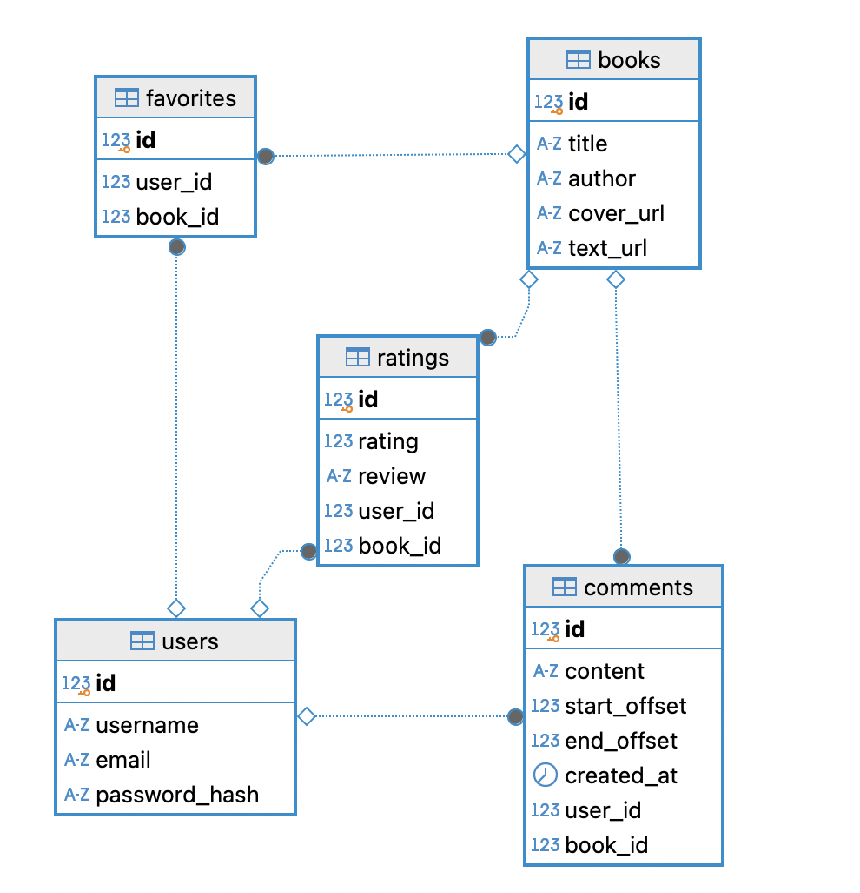

# Ибрагимов Артём М3300

### [Ссылка на деплой](https://m3300-ibragimov-back.onrender.com)

### Тема: книжная соцсеть Читайка.

Что такое Читайка? Это соцсеть, где социальной единицей становятся книги, а в частности мысли из них. В Читайке вы можете не только читать книги, видеть, что читают друзья и оставлять рецензии, но и можете комментировать каждую строчку книги так, что другие пользователи увидят ваши комментарии, когда дойдут до них в тексте. 

Неожиданный сюжет поворот сюжета? Не знаете с кем поделиться, ведь никто не погружен в контекст? Оставь комментарий в читайке и раздели эмоции с другими пользователями!!

Не понял очередное душное доказательство в учебнике по матану? Неравнодушные пользователи нашей соцсети помогут понять его тебе и всем последующим читателям.

Идея соцсети позаимствована Читайка взята из реальной жизни: когда в школе вы получали библиотечные учебники - на полях всегда были комментарии: объяснения, юмор или неразделенные эмоции. Почему бы не привнести это в электронные книги?

### Макет проекта

### Схема базы данных

### Описание сущностей и связей

База данных спроектирована согласно принципам DDD и реляционной модели. Основные сущности:

1.  **Users (Пользователи)**
    *   Хранит данные для аутентификации (`username`, `email`, `password_hash`).
    *   Является корнем агрегации для действий пользователя.
    *   **Связи:** Имеет множество *Comments*, *Ratings* и *Favorites*.

2.  **Books (Книги)**
    *   Содержит метаданные книги и ссылки на контент (`text_url`, `cover_url`).
    *   **Связи:** Является объектом для *Comments*, *Ratings* и *Favorites*.

3.  **Comments (Комментарии к тексту)**
    *   Ключевая сущность проекта. Хранит текст комментария и привязку к позиции в тексте книги (`start_offset`, `end_offset`).
    *   **Связи:**
        *   *Many-to-One* к **Users** (автор).
        *   *Many-to-One* к **Books** (к какой книге относится).
        *   Каскадное удаление: при удалении книги или пользователя комментарии удаляются.

4.  **Ratings (Рейтинги и рецензии)**
    *   Хранит оценку (1-5) и текстовую рецензию на книгу целиком.
    *   **Связи:** Связывает **User** и **Book**. Настроено ограничение уникальности: один пользователь может оставить только одну оценку одной книге.

5.  **Favorites (Избранное)**
    *   Сущность-связка, реализующая отношение "Многие-ко-Многим" между пользователями и книгами.
    *   Позволяет пользователю формировать список отложенных или любимых книг.
