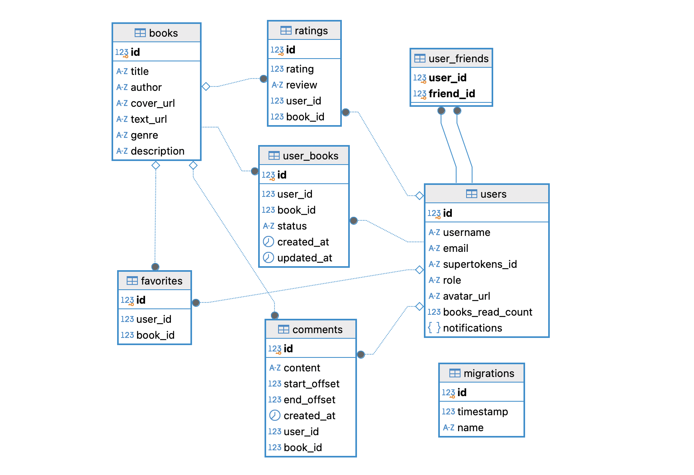

# Ибрагимов Артём М3300

### [Ссылка на деплой](https://m3300-ibragimov-back.onrender.com)

### Тема: книжная соцсеть Читайка.

Что такое Читайка? Это соцсеть, где социальной единицей становятся книги, а в частности мысли из них. В Читайке вы можете не только читать книги, видеть, что читают друзья и оставлять рецензии, но и можете комментировать каждую строчку книги так, что другие пользователи увидят ваши комментарии, когда дойдут до них в тексте. 

Неожиданный сюжет поворот сюжета? Не знаете с кем поделиться, ведь никто не погружен в контекст? Оставь комментарий в читайке и раздели эмоции с другими пользователями!!

Не понял очередное душное доказательство в учебнике по матану? Неравнодушные пользователи нашей соцсети помогут понять его тебе и всем последующим читателям.

Идея соцсети Читайка взята из реальной жизни: когда в школе вы получали библиотечные учебники - на полях всегда были комментарии: объяснения, юмор или неразделенные эмоции. Почему бы не привнести это в электронные книги?

### Схема базы данных

### Описание сущностей и связей

База данных спроектирована согласно принципам DDD и реляционной модели. Основные сущности:

1.  **Users (Пользователи)**
    *   Хранит профиль пользователя: `username`, `email`, `avatar_url`.
    *   `supertokens_id`: связь с внешней системой аутентификации.
    *   `role`: роль пользователя (администратор / пользователь).
    *   `notifications`: JSON-поле для хранения уведомлений.
    *   **Связи:** Имеет множество связей с книгами через таблицу-связку *user_books*, а также *Comments*, *Ratings* и *Favorites*. Может иметь друзей через таблицу *user_friends*.

2.  **Books (Книги)**
    *   Содержит метаданные книги: `title`, `author`, `genre`, `description`.
    *   Хранит ссылки на контент в объектном хранилище: `text_url` (текст книги), `cover_url` (обложка).
    *   **Связи:** Является объектом для *Comments*, *Ratings*, *Favorites* и *UserBooks*.

3.  **UserBooks (Книжная полка пользователя)**
    *   Связующая сущность между пользователем и книгой.
    *   `status`: определяет состояние чтения (например, "Читаю", "Прочитано").
    *   Хранит временные метки начала и обновления статуса.

4.  **Comments (Комментарии в тексте)**
    *   Ключевая фишка проекта. Привязаны не просто к книге, а к конкретному фрагменту текста.
    *   `start_offset`, `end_offset`: координаты выделенного текста внутри книги.
    *   `content`: текст комментария.
    *    **Связи:**
        *   *Many-to-One* к **Users** (автор).
        *   *Many-to-One* к **Books** (к какой книге относится).
        *   Каскадное удаление: при удалении книги или пользователя комментарии удаляются.

5.  **Ratings (Рецензии и оценки)**
    *   `rating`: числовая оценка книги.
    *   `review`: текстовая рецензия.
    *   **Связи:** Связывает **User** и **Book**. Настроено ограничение уникальности: один пользователь может оставить только одну оценку одной книге.

6.  **Favorites (Избранное)**
    *   Сущность-связка, реализующая отношение "Многие-ко-Многим" между пользователями и книгами.
    *   Позволяет пользователю формировать список отложенных или любимых книг.

7.  **UserFriends (Друзья)**
    *   Реализует социальный граф (подписки) между пользователями (Many-to-Many).

