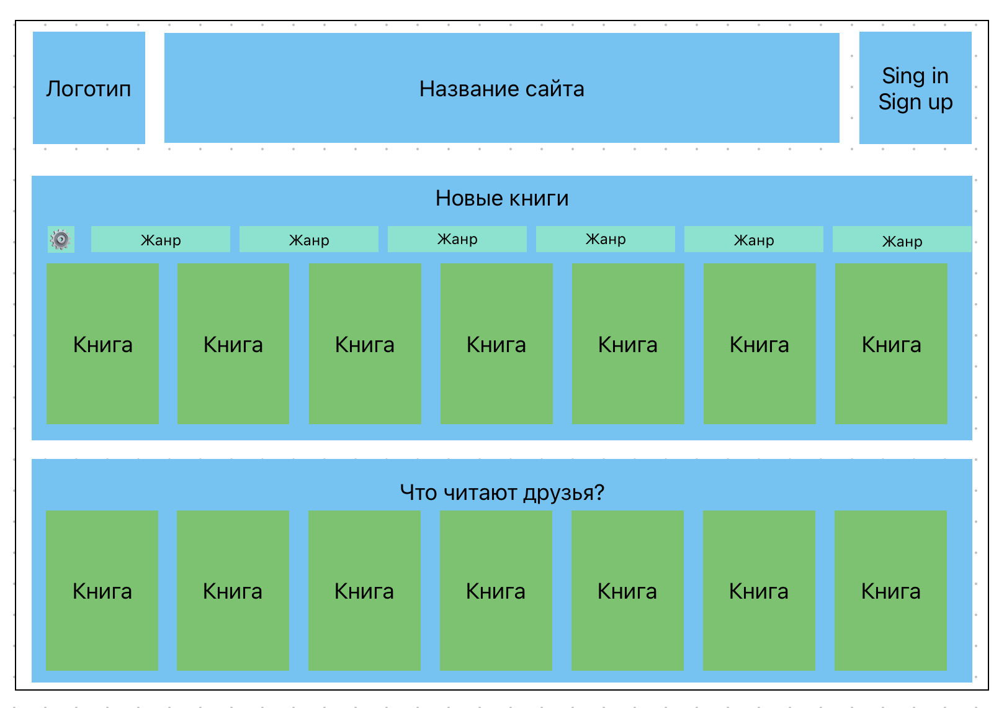

# Ибрагимов Артём М3300

### [Ссылка на деплой](https://m3300-ibragimov-back.onrender.com)

### Тема: книжная соцсеть Читайка.

Что такое Читайка? Это соцсеть, где социальной единицей становятся книги, а в частности мысли из них. В Читайке вы можете не только читать книги, видеть, что читают друзья и оставлять рецензии, но и можете комментировать каждую строчку книги так, что другие пользователи увидят ваши комментарии, когда дойдут до них в тексте. 

Неожиданный сюжет поворот сюжета? Не знаете с кем поделиться, ведь никто не погружен в контекст? Оставь комментарий в читайке и раздели эмоции с другими пользователями!!

Не понял очередное душное доказательство в учебнике по матану? Неравнодушные пользователи нашей соцсети помогут понять его тебе и всем последующим читателям.

Идея соцсети позаимствована Читайка взята из реальной жизни: когда в школе вы получали библиотечные учебники - на полях всегда были комментарии: объяснения, юмор или неразделенные эмоции. Почему бы не привнести это в электронные книги?

### Макет проекта

